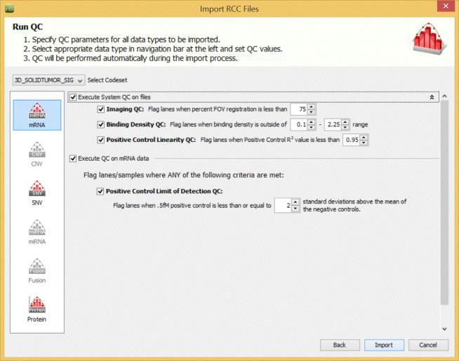
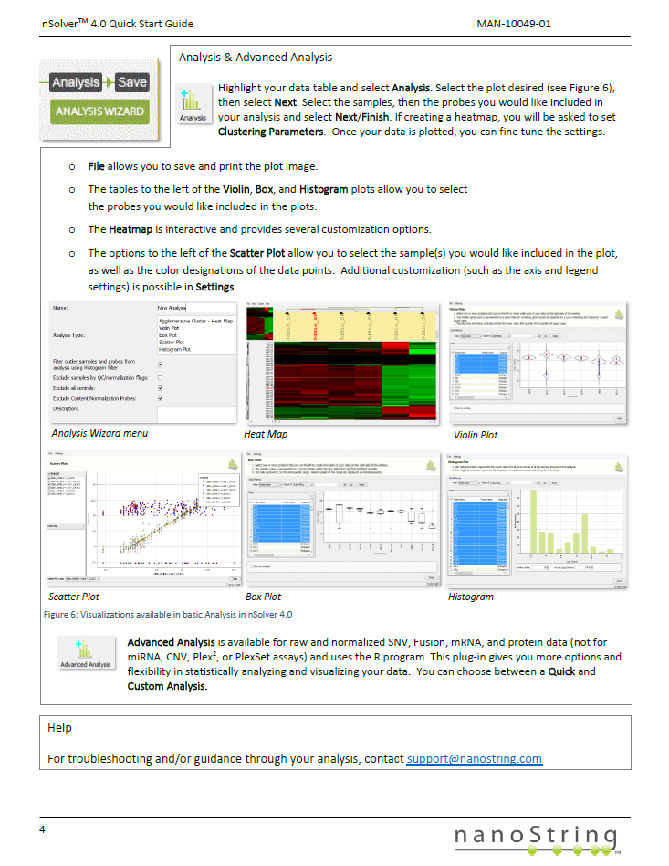
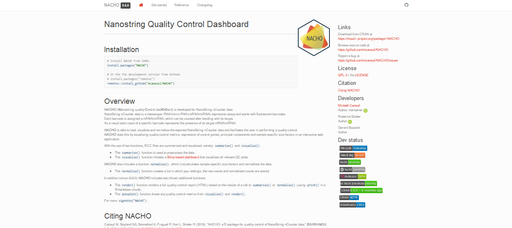

```{r setup, include = FALSE}
options(stringsAsFactors = FALSE)
options(width = 80)

output_directory <- params[["output_directory"]]

### Load packages and functions
library(tidyverse)
library(broom)
library(scales)
library(grid)
library(knitr)
library(rmarkdown)

source("https://github.com/mcanouil/DEV/raw/master/R/theme_black.R")

### Set knitr rmarkdown chunk options
opts_chunk$set(
  include = TRUE,
  echo = FALSE,
  warning = FALSE,
  message = FALSE,
  eval = params[["eval"]],
  tidy = FALSE,
  crop = TRUE,
  autodep = FALSE,
  dpi = 120,
  cache = FALSE,
  # cache.path = NULL,
  width = getOption("width"),
  results = "asis",
  comment = "#>",
  fig.align = "center",
  fig.path = "images/"
)

### Define theme
theme_set(theme_black(base_size = 10))
```

# Introduction | NanoString™ nCounter®</br>&</br>R packages {.flexbox .vcenter}

## NanoString™ nCounter®

<iframe width="768" height="432" src="https://www.youtube.com/embed/dlz3q3Bq5B4"></iframe>

## NanoString™ nCounter®

The nCounter® platform provides a simple and cost effective solution for multiplex analysis of *up to 800 RNA, DNA, or protein targets* from your precious samples.

- Save Time
    - Expertly curated pre-formatted panels for human, mouse and non-human primate
    - ~15-minutes total hands-on time with *no amplification*, *cDNA conversion* or *library prep* required
- Save Sample
    - *Combine RNA, DNA, and protein panels* for a comprehensive 3D Biology™ view of each sample
    - *Optimized performance on difficult sample types* including FFPE, tissue, lysates and biofluid samples

## NanoString™ nCounter®

- Save Resources
    - Advanced analysis tools included with system reduce the need for Bioinformatics support
    
```{r, echo = FALSE, out.width = 600}
include_graphics("images/nsolver_01.png")
```


## NanoString™ nCounter® nSolver™

```{r, echo = FALSE, out.width = 600}

```


## NanoString™ nCounter® nSolver™

nSolver 4.0 ressources:

- [Quick Start guide](https://www.nanostring.com/download_file/view/1170/8241)
- [User Manual](https://www.nanostring.com/download_file/view/1168/8241)

<div class="columns-2">
<div class="columns-2">
```{r, echo = FALSE, out.width = 200}
include_graphics("images/nsolver_03.png")
```

```{r, echo = FALSE, out.width = 200}
include_graphics("images/nsolver_04.png")
```
</div>

<div class="columns-2">
```{r, echo = FALSE, out.width = 200}
include_graphics("images/nsolver_05.png")
```

```{r, echo = FALSE, out.width = 200}

```
</div>
</div>

## nSolver™ alternatives?

<div style="float: left; width: 45%;">
- [NanoStringNorm](https://cran.r-project.org/package=NanoStringNorm)
    - On CRAN
    - Since 2011-09-16
    - Last 2017-11-10
- [nanostringr](https://cran.r-project.org/package=nanostringr)
    - On CRAN
    - Since 2019-03-15
    - Last 2019-04-24
</div>
<div style="float: right; width: 45%;">
- [NanoStringDiff](https://www.bioconductor.org/packages/NanoStringDiff/)
    - On Bioconductor
    - Since 2016-04-23
    - Last 2018-01-24
- [NanoStringQCPro](https://www.bioconductor.org/packages/NanoStringQCPro/)
    - On Bioconductor
    - Since 2015-08-13
    - Last 2018-04-10
</div>


## Our alternative: *NACHO*
```{r, include = FALSE, results = "hide", message = FALSE, warning = FALSE}
webshot::webshot(
  url = "https://doi.org/10.1093/bioinformatics/btz647", 
  file = "images/nacho_article.png", 
  selector = ".widget-ArticleTopInfo"
)

webshot::webshot(
  url = "https://mcanouil.github.io/NACHO/", 
  file = "images/nacho_website.png", 
  vwidth = 1920,
  vheight = 855,
  zoom = 0.65,
  cliprect = "viewport"
)
```

- [NACHO](https://cran.r-project.org/package=NACHO) on CRAN (Since 2019-04-28; Next 2019-10)

<div style="float: left; width: 15%;">
```{r, echo = FALSE, out.width = 100}
include_graphics("https://raw.githubusercontent.com/mcanouil/NACHO/master/man/figures/nacho_hex.png")
```
</div>
<div style="float: right; width: 85%;">
```{r, echo = FALSE, out.width = 600}

```
</div>

```{r, echo = FALSE, out.width = 700}

```


# </img>  | (**NA**nostring quality **C**ontrol das**H**b**O**ard) {.flexbox .vcenter}

## Overview

*NACHO* (**NA**nostring quality **C**ontrol das**H**b**O**ard) is developed for NanoString nCounter data.  

*NACHO* is able to **load**, **visualise** and **normalise** the exported NanoString nCounter data and facilitates the user in performing a quality control.  

*NACHO* does this by visualising in an **interactive** web application:

- **quality control metrics**
- **expression of control genes**
- **principal components**
- **sample specific size factors**

## The functions

RCC files are summarised and visualised using two functions:

* The `summarise()` function is used to preprocess the data.
* The `visualise()` function initiates a [Shiny-based dashboard](https://shiny.rstudio.com/) that visualises all relevant QC plots.

*NACHO* also includes a function `normalise()`, which (re)calculates sample specific size factors and normalises the data.

* The `normalise()` function creates a list in which your settings, the raw counts and normalised counts are stored.


# Let's play a bit with | </img>  {.flexbox .vcenter}

## Get some RCC files from GEO

In this example we use a mRNA dataset from the study of @bruce_identification_2015 with the GEO accession number: **GSE70970** 

```{r, echo = TRUE, results = "hide", message = FALSE, warning = FALSE}
library(GEOquery)
gse <- getGEO("GSE70970")
targets <- pData(phenoData(gse[[1]]))
getGEOSuppFiles(GEO = "GSE70970", baseDir = ".")
untar(
  tarfile = "./GSE70970/GSE70970_RAW.tar", 
  exdir = "./GSE70970/Data"
)
targets$IDFILE <- list.files("./GSE70970/Data")
```

## Load RCC files with `summarise()`

The `housekeeping_genes` and `normalisation_method` arguments respectively indicate which housekeeping genes and normalisation method should be used.

```{r, echo = TRUE, results = "hold"}
library(NACHO)
GSE70970_sum <- summarise(
  data_directory = "./GSE70970/Data", 
  ssheet_csv = targets, 
  id_colname = "IDFILE",
  housekeeping_genes = NULL,
  housekeeping_predict = TRUE,
  normalisation_method = "GEO",
  n_comp = 5
)
```

## Load RCC files with `summarise()`

```{r, echo = TRUE, results = "hold"}
GSE70970_sum
```


## (re)Normalise with `normalise()`

*NACHO* allows the discovery of housekeeping genes within your own dataset.

*NACHO* finds the five best suitable housekeeping genes, however, it is possible that one of these five genes might not be suitable.

The discovered housekeeping genes are saved in a global variable named **predicted_housekeeping**. 

```{r, echo = TRUE, results = "hold"}
GSE70970_sum[["housekeeping_genes"]]
```

## (re)Normalise with `normalise()`

Let's say `"GEO"` is not the best normalisation for our dataset and we want to use `"GLM"` instead.

```{r, echo = TRUE, results = "hold"}
GSE70970_norm <- normalise(
  nacho_object = GSE70970_sum,
  normalisation_method = "GLM", 
  remove_outliers = TRUE
)
```

## (re)Normalise with `normalise()`

```{r, echo = TRUE, results = "hold"}
GSE70970_norm
```

## It's Shiny time (`visualise()`)

```{r, echo = TRUE, eval = FALSE}
visualise(GSE70970_sum)
```
```{r, echo = FALSE, results = "hold", message = TRUE}
message('[NACHO] Custom "outliers_thresholds" can be loaded for later use with:\n  outliers_thresholds <- readRDS("outliers_thresholds.rds")')
```
```{r, echo = FALSE, results = "hide", eval = interactive()}
visualise <- function (nacho_object) {
  mandatory_fields <- c("access", "housekeeping_genes", "housekeeping_predict", 
    "housekeeping_norm", "normalisation_method", "remove_outliers", 
    "n_comp", "data_directory", "pc_sum", "nacho", "outliers_thresholds", 
    "raw_counts", "normalised_counts")
  if (!all(mandatory_fields %in% names(nacho_object))) {
    stop("[NACHO] Mandatory fields are missing in \"", substitute(nacho_object), 
      "\"!\n", "  \"summarise()\" and/or \"normalise()\" must be called before \"visualise()\".")
  }
  if (!interactive()) {
    stop("[NACHO] Must be run in an interactive R session!")
  }
  id_colname <- nacho_object[["access"]]
  housekeeping_genes <- nacho_object[["housekeeping_genes"]]
  housekeeping_norm <- nacho_object[["housekeeping_norm"]]
  pc_sum <- nacho_object[["pc_sum"]]
  nacho <- nacho_object[["nacho"]]
  save_path_default <- nacho_object[["data_directory"]]
  type_set <- attr(nacho_object, "RCC_type")
  outliers_env <- new.env()
  assign(x = "outliers_thresholds", value = nacho_object[["outliers_thresholds"]], 
    envir = outliers_env)
  message("[NACHO] Custom \"outliers_thresholds\" can be loaded for later use with:\n", 
    "  outliers_thresholds <- readRDS(\"", tempdir(), "/outliers_thresholds.rds\")")
  shiny::addResourcePath("logo", system.file("help", "figures", 
    package = "NACHO"))
  app <- shiny::shinyApp(ui = shiny::fluidPage(shiny::sidebarLayout(shiny::sidebarPanel(width = 3, 
    shiny::div(shiny::img(src = "logo/nacho_hex.png", height = 150), 
      align = "center"), shiny::br(), shiny::tabsetPanel(id = "settings", 
      selected = "Panel", shiny::tabPanel(title = "General", 
        shiny::br(), shiny::numericInput(inputId = "font_size", 
          label = "Font size:", value = 14), shiny::numericInput(inputId = "max_factors", 
          label = "Max factors (legend):", value = 10)), 
      shiny::tabPanel(title = "Panel", shiny::br(), shiny::uiOutput(outputId = "interfaceA"), 
        shiny::uiOutput(outputId = "interfaceB"), shiny::uiOutput(outputId = "interfaceC"), 
        shiny::uiOutput(outputId = "interfaceD"), shiny::uiOutput(outputId = "interfaceE1"), 
        shiny::uiOutput(outputId = "interfaceE2"), shiny::uiOutput(outputId = "interfaceF"), 
        shiny::uiOutput(outputId = "interfaceG"), shiny::uiOutput(outputId = "interfaceH")), 
      shiny::tabPanel(title = "Download", shiny::br(), 
        shiny::textInput(inputId = "name", label = "Plot name (with extension):"), 
        shiny::textInput(inputId = "save_path", label = "Output directory:", 
          value = save_path_default), shiny::numericInput(inputId = "w", 
          label = "Width (inch):", value = 8), shiny::numericInput(inputId = "h", 
          label = "Height (inch):", value = 6), shiny::numericInput(inputId = "dpi", 
          label = "DPI:", value = 120), shiny::div(shiny::actionButton(inputId = "do", 
          label = "Download"), align = "center")))), 
    shiny::mainPanel(width = 9, shiny::tabsetPanel(id = "maintabs", 
      shiny::tabPanel(title = "QC Metrics", value = "met"), 
      shiny::tabPanel(title = "Control Genes", value = "cg"), 
      shiny::tabPanel(title = "QC Visuals", value = "vis"), 
      shiny::tabPanel(title = "Normalisation Factors", 
        value = "norm"), shiny::tabPanel(title = "Outlier Table", 
        value = "ot"), shiny::tabPanel(title = "About", 
        value = "about")), shiny::uiOutput("subtab"), 
      shiny::dataTableOutput("outlier_table"), shiny::plotOutput(outputId = "all", 
        width = "100%", height = "600px")))), server = function(input, 
    output) {
    shiny::observeEvent(input$do, {
      file_ext <- function(x) {
        pos <- regexpr("\\.([[:alnum:]]+)$", x)
        ifelse(pos > -1L, substring(x, pos + 1L), "")
      }
      if (!dir.exists(input$save_path)) {
        dir.create(path = input$save_path)
      }
      clean_path <- normalizePath(input$save_path)
      ggplot2::ggsave(filename = paste0(clean_path, "/", 
        input$name, if (file_ext(input$name) == "") 
          ".png"), width = input$w, height = input$h, 
        units = "in", dpi = input$dpi)
      shiny::showNotification(paste0("Plot successfully saved to: \"", 
        clean_path, "\""))
    })
    output$subtab <- shiny::renderUI({
      shiny::req(input$maintabs != "ot")
      switch(EXPR = input$maintabs, met = {
        switch(EXPR = type_set, n1 = {
          shiny::tabsetPanel(id = "tabs", shiny::tabPanel("Binding Density", 
            value = "BD"), shiny::tabPanel("Imaging", 
            value = "FoV"), shiny::tabPanel("Positive Control Linearity", 
            value = "PC"), shiny::tabPanel("Limit of Detection", 
            value = "LoD"))
        }, n8 = {
          shiny::tabsetPanel(id = "tabs", shiny::tabPanel("Binding Density", 
            value = "BD"), shiny::tabPanel("Imaging", 
            value = "FoV"))
        })
      }, cg = {
        tabslist <- unique(nacho[["CodeClass"]][-grep("Endogenous", 
          nacho[["CodeClass"]])])
        tabslist <- setdiff(c(tabslist, "Control Probe Expression"), 
          "Message")
        do.call(what = "tabsetPanel", c(id = "tabs", 
          lapply(tabslist, function(i) {
            shiny::tabPanel(title = i)
          })))
      }, norm = {
        if (housekeeping_norm & !is.null(housekeeping_genes)) {
          shiny::tabsetPanel(id = "tabs", shiny::tabPanel("Positive Factor vs. Background Threshold", 
            value = "pfbt"), shiny::tabPanel("Housekeeping Factor", 
            value = "hf"), shiny::tabPanel("Normalisation Result", 
            value = "norm_res"))
        } else {
          shiny::tabsetPanel(id = "tabs", shiny::tabPanel("Positive Factor vs. Background Threshold", 
            value = "pfbt"), shiny::tabPanel("Normalisation Result", 
            value = "norm_res"))
        }
      }, vis = {
        shiny::tabsetPanel(id = "tabs", shiny::tabPanel("Average Count vs. Binding Density", 
          value = "MC-BD"), shiny::tabPanel("Average Count vs. Median Count", 
          value = "MC-MedC"), shiny::tabPanel("Principal Component", 
          value = "prin"))
      }, about = {
        vignette_exists <- system.file("doc", "NACHO.Rmd", 
          package = "NACHO")
        if (nchar(vignette_exists) == 0) {
          shiny::p("The vignette was not build.")
        }
        details <- c(NACHO = paste("*NACHO* (**NA**nostring quality **C**ontrol das**H**b**O**ard) is developed for NanoString nCounter data.  ", 
          "NanoString nCounter data is a messenger-RNA/micro-RNA (mRNA/miRNA) expression assay and works with fluorescent barcodes.  ", 
          "Each barcode is assigned a mRNA/miRNA, which can be counted after bonding with its target.  ", 
          "As a result each count of a specific barcode represents the presence of its target mRNA/miRNA.", 
          "\n", "*NACHO* is able to load, visualise and normalise the exported NanoString nCounter data and facilitates the user in performing a quality control.  ", 
          "*NACHO* does this by visualising quality control metrics, expression of control genes, principal components and sample specific size factors in an interactive web application.", 
          "\n", "With the use of two functions, RCC files are summarised and visualised, namely: `summarise()` and `visualise()`.", 
          "\n", "* The `summarise()` function is used to preprocess the data.", 
          "* The `visualise()` function initiates a [Shiny-based dashboard](https://shiny.rstudio.com/) that visualises all relevant QC plots.", 
          "\n", "*NACHO* also includes a function `normalise()`, which (re)calculates sample specific size factors and normalises the data.", 
          "\n", "* The `normalise()` function creates a list in which your settings, the raw counts and normalised counts are stored.", 
          "\n", "In addition (since v0.6.0) *NACHO* includes two (three) additional functions:", 
          "\n", "* The `render()` function renders a full quality-control report (HTML) based on the results of a call to `summarise()` or `normalise()` (using `print()` in a Rmarkdown chunk).", 
          "* The `autoplot()` function draws any quality-control metrics from `visualise()` and `render()`.", 
          "\n", "For more `vignette(\"NACHO\")`.", sep = "\n"), 
          `Binding Density` = paste("The imaging unit only counts the codes that are unambiguously distinguishable.", 
            "It simply will not count codes that overlap within an image.", 
            "This provides increased confidence that the molecular counts you receive are from truly recognisable codes.", 
            "Under most conditions, forgoing the few barcodes that do overlap will not impact your data.", 
            "Too many overlapping codes in the image, however, will create a condition called image saturation in which significant data loss could occur (critical data loss from saturation is uncommon).", 
            "\n", "To determine the level of image saturation, the nCounter instrument calculates the number of optical features per square micron for each lane as it processes the images.", 
            "This is called the **Binding Density**.", 
            "The **Binding Density** is useful for determining whether data collection has been compromised due to image saturation.", 
            "The acceptable range for **Binding Density** is:", 
            "\n", "* `0.1 - 2.25` for **MAX**/**FLEX** instruments", 
            "* `0.1 - 1.8` for **SPRINT** instruments", 
            "\n", "Within these ranges, relatively few reporters on the slide surface will overlap, enabling the instrument to accurately tabulate counts for each reporter species.", 
            "A **Binding Density** significantly greater than the upper limit in either range is indicative of overlapping reporters on the slide surface.", 
            "The counts observed in lanes with a **Binding Density** at this level may have had significant numbers of codes ignored, which could potentially affect quantification and linearity of the assay.", 
            "Some of the factors that may contribute to increased **Binding Density** are listed in the Factors affecting **Binding Density** box.", 
            sep = "\n"), `Field of View (Imaging)` = paste("Each individual lane scanned on an nCounter system is divided into a few hundred imaging sections, called Fields of View (**FOV**), the exact number of which will depend on the system being used (*i.e.*, **MAX/FLEX** or **SPRINT**), and the scanner settings selected by the user.", 
            "The system images these FOVs separately, and sums the barcode counts of all **FOV**s from a single lane to form the final raw data count for each unique barcode target.", 
            "Finally, the system reports the number of **FOV**s successfully imaged as FOV Counted.", 
            "\n", "Significant discrepancy between the number of **FOV** for which imaging was attempted (**FOV Count**) and for which imaging was successful (**FOV Counted**) may indicate an issue with imaging performance.", 
            "Recommended percentage of registered FOVs (*i.e.*, **FOV Counted** over **FOV Count**) is `75 %`.", 
            "Lanes will be flagged if this percentage is lower.", 
            sep = "\n"), `Positive Control linearity` = paste("Six synthetic DNA control targets are included with every nCounter Gene Expression assay.", 
            "Their concentrations range linearly from `128 fM` to `0.125 fM`, and they are referred to as **POS_A** to **POS_F**, respectively.", 
            "These **Positive Controls** are typically used to measure the efficiency of the hybridization reaction, and their step-wise concentrations also make them useful in checking the linearity performance of the assay.", 
            "An R2 value is calculated from the regression between the known concentration of each of the **Positive Controls** and the resulting counts from them (this calculation is performed using log2-transformed values).", 
            "\n", "Since the known concentrations of the **Positive Controls** increase in a linear fashion, the resulting counts should, as well.", 
            "Therefore, R2 values should be higher than `0.95`.", 
            "\n", "Note that because POS_F has a known concentration of `0.125 fM`, which is considered below the limit of detection of the system, it should be excluded from this calculation (although you will see that **POS_F** counts are significantly higher than the negative control counts in most cases).", 
            sep = "\n"), `Limit of Detection` = paste("The limit of detection is determined by measuring the ability to detect **POS_E**, the `0.5 fM` positive control probe, which corresponds to about 10,000 copies of this target within each sample tube.", 
            "On a **FLEX**/**MAX** system, the standard input of `100 ng` of total RNA will roughly correspond to about 10,000 cell equivalents (assuming one cell contains `10 pg` total RNA on average).", 
            "An nCounter assay run on the **FLEX**/**MAX** system should thus conservatively be able to detect roughly one transcript copy per cell for each target (or 10,000 total transcript copies).", 
            "In most assays, you will observe that even the **POS_F** probe (equivalent to 0.25 copies per cell) is detectable above background.", 
            "\n", "To determine whether **POS_E** is detectable, it can be compared to the counts for the negative control probes.", 
            "Every nCounter Gene Expression assay is manufactured with eight negative control probes that should not hybridize to any targets within the sample.", 
            "Counts from these will approximate general non-specific binding of probes within the samples being run.", 
            "The counts of **POS_E** should be higher than two times the standard deviation above the mean of the negative control.", 
            sep = "\n"))
        about_md <- tempfile(fileext = "_about.md")
        unlink(about_md)
        for (iname in names(details)) {
          cat(paste0("\n\n### ", iname, "\n\n", details[iname], 
            "\n"), file = about_md, append = TRUE)
        }
        shiny::p(shiny::includeMarkdown(about_md))
      })
    })
    output$interfaceA <- shiny::renderUI({
      shiny::req(input$maintabs)
      if (input$maintabs == "met") {
        shiny::selectInput(inputId = "attribute", label = "Select x-axis", 
          choices = c("CartridgeID", "Date", "ID", "ScannerID", 
            "StagePosition"))
      }
      else if (input$maintabs %in% c("vis", "norm", "cg")) {
        shiny::radioButtons(inputId = "colour_choice", 
          label = "Select colour attributes:", choiceNames = c("RCC attributes", 
            "Samplesheet attributes"), choiceValues = c(FALSE, 
            TRUE))
      }
    })
    output$interfaceB <- shiny::renderUI({
      shiny::req(input$maintabs)
      colour_variables <- c(id_colname, names(which(sapply(X = nacho, 
        FUN = function(y) {
          unique_y <- unique(y)
          length(unique_y) <= 20 && length(unique_y) > 
            0 && any(!is.na(unique_y))
        }))))
      if (input$maintabs == "met") {
        shiny::selectInput(inputId = "meta", label = "Coloured by:", 
          choices = colour_variables, selected = "CodeClass")
      }
      else if (input$maintabs %in% c("vis", "norm", "cg")) {
        colour <- ifelse(is.null(input$colour_choice), 
          TRUE, input$colour_choice)
        if (colour) {
          shiny::selectInput(inputId = "meta", label = "Coloured by:", 
            choices = colour_variables, selected = "CodeClass")
        }
        else {
          shiny::selectInput(inputId = "meta", label = "Coloured by:", 
            choices = c("CartridgeID", "Date", "ID", 
              "ScannerID", "StagePosition"))
        }
      }
    })
    output$interfaceC <- shiny::renderUI({
      shiny::req(input$maintabs %in% c("met", "vis"))
      switch(EXPR = input$maintabs, met = {
        shiny::div(shiny::checkboxInput(inputId = "outlier", 
          label = "View outliers", value = TRUE), align = "center")
      }, vis = {
        shiny::req(input$tabs == "prin")
        shiny::selectInput(inputId = "pcA_sel", label = "PC on x-axis:", 
          choices = grep("^PC[0-9]+$", colnames(nacho), 
            value = TRUE))
      })
    })
    output$interfaceD <- shiny::renderUI({
      shiny::req(input$maintabs %in% c("met", "vis"))
      switch(EXPR = input$maintabs, met = {
        shiny::div(shiny::checkboxInput(inputId = "outlab", 
          label = "View outlier labels"), align = "center")
      }, vis = {
        shiny::req(input$tabs == "prin")
        shiny::selectInput(inputId = "pcB_sel", label = "PC on y-axis:", 
          choices = grep("^PC[0-9]+$", colnames(nacho), 
            value = TRUE), selected = grep("^PC[0-9]+$", 
            colnames(nacho), value = TRUE)[2])
      })
    })
    output$interfaceE1 <- shiny::renderUI({
      shiny::req(!input$maintabs %in% c("ot", "about"))
      shiny::sliderInput(inputId = "point_size", label = "Point size", 
        min = 1, max = 5, value = round(0.15 * input$font_size))
    })
    output$interfaceE2 <- shiny::renderUI({
      shiny::req(input$maintabs == "met")
      shiny::sliderInput(inputId = "outlier_size", label = "Outlier point size (relative)", 
        min = 0, max = 1, value = 0.5)
    })
    output$interfaceF <- shiny::renderUI({
      shiny::req(input$maintabs == "met" & input$tabs == 
        "BD")
      shiny::radioButtons(inputId = "BD_choice", label = "Select instrument", 
        choiceNames = c("MAX/FLEX", "SPRINT"), choiceValues = c(2.25, 
          1.8), inline = TRUE)
    })
    output$interfaceG <- shiny::renderUI({
      shiny::req(input$maintabs == "met")
      shiny::req(input$BD_choice)
      outliers_thresholds <- get(x = "outliers_thresholds", 
        envir = outliers_env)
      ranges <- c(BD = c(0.1, input$BD_choice, unname(outliers_thresholds[["BD"]])), 
        FoV = c(50, 100, unname(outliers_thresholds[["FoV"]])), 
        LoD = c(0, 30, unname(outliers_thresholds[["LoD"]])), 
        PC = c(0.5, 1, unname(outliers_thresholds[["PC"]])))
      shiny::req(input$tabs)
      if (input$tabs == "BD") {
        shiny::sliderInput(inputId = "threshold", label = sprintf("Custom QC threshold (default: %s - %s)", 
          ranges["BD1"], ranges["BD2"]), min = as.numeric(ranges["BD1"]), 
          max = as.numeric(ranges["BD2"]), value = c(as.numeric(ranges["BD3"]), 
            as.numeric(ranges["BD4"])))
      }
      else if (input$tabs %in% c("FoV", "LoD", "PC")) {
        shiny::sliderInput(inputId = "threshold", label = sprintf("Custom QC threshold (default: %s)", 
          as.numeric(ranges[paste0(input$tabs, "3")])), 
          min = as.numeric(ranges[paste0(input$tabs, 
            "1")]), max = as.numeric(ranges[paste0(input$tabs, 
            "2")]), value = as.numeric(ranges[paste0(input$tabs, 
            "3")]))
      }
    })
    shiny::observeEvent(c(input$tabs, input$threshold), 
      {
        outliers_thresholds <- get(x = "outliers_thresholds", 
          envir = outliers_env)
        outliers_thresholds[[input$tabs]] <- input$threshold
        assign(x = "outliers_thresholds", value = outliers_thresholds, 
          envir = outliers_env)
        saveRDS(object = outliers_thresholds, file = paste0(tempdir(), 
          "/outliers_thresholds.rds"))
      })
    output$interfaceH <- shiny::renderUI({
      shiny::req(input$maintabs %in% c("cg", "norm"))
      shiny::req(input$tabs %in% c("Control Probe Expression", 
        "norm_res"))
      shiny::div(shiny::checkboxInput(inputId = "with_smooth", 
        label = "Smooth line (loess)", value = 0), align = "center")
    })
    output$outlier_table <- shiny::renderDataTable({
      shiny::req(input$maintabs == "ot")
      details_out <- details_outlier(nacho_df = nacho, 
        id_colname = id_colname, outliers_thresholds = get(x = "outliers_thresholds", 
          envir = outliers_env))
      all_out <- unique(unlist(details_out))
      data.frame(Accession = all_out, BD = ifelse(all_out %in% 
        details_out[["binding_out"]], "FAIL", "PASS"), 
        FOV = ifelse(all_out %in% details_out[["fov_out"]], 
          "FAIL", "PASS"), PL = ifelse(all_out %in% 
          details_out[["pc_out"]], "FAIL", "PASS"), 
        LOD = ifelse(all_out %in% details_out[["lod_out"]], 
          "FAIL", "PASS"), PSF = ifelse(all_out %in% 
          details_out[["fac_out"]], "FAIL", "PASS"), 
        HSF = ifelse(all_out %in% details_out[["house_out"]], 
          "FAIL", "PASS"))
    })
    output$all <- shiny::renderPlot({
      shiny::req(!input$maintabs %in% c("ot", "about"))
      labels <- c(MC = "Average Counts", MedC = "Median Counts", 
        BD = "Binding Density", FoV = "Field of View", 
        PC = "Positive Control linearity", LoD = "Limit of Detection")
      units <- c(BD = "\"(Optical features / \", mu, m^2, \")\"", 
        FoV = "\"(% Counted)\"", PC = "(R^2)", LoD = "\"(Z)\"")
      shiny::req(input$maintabs)
      shiny::req(input$font_size)
      main <- ifelse(is.null(input$maintabs), "met", input$maintabs)
      p <- switch(EXPR = main, met = {
        shiny::req(input$tabs)
        shiny::req(input$threshold)
        shiny::req(input$tabs == "FoV" | input$tabs == 
          "LoD" | input$tabs == "PC" | input$tabs == 
          "BD")
        shiny::req(input$attribute, input$meta)
        colour_name <- input$meta
        if (input$tabs == "BD") {
          local_data <- nacho[nacho[[input$tabs]] >= 
            input$threshold[1] & nacho[[input$tabs]] <= 
            input$threshold[2], ]
          outliers_data <- nacho[nacho[[input$tabs]] <= 
            input$threshold[1] | nacho[[input$tabs]] >= 
            input$threshold[2], ]
        } else if (input$tabs %in% c("FoV", "LoD", "PC")) {
          local_data <- nacho[nacho[[input$tabs]] >= 
            input$threshold[1], ]
          outliers_data <- nacho[nacho[[input$tabs]] <= 
            input$threshold[1], ]
        }
        if (input$tabs %in% c("PC", "LoD")) {
          shiny::req(!all(local_data[[input$tabs]] == 
            0))
        }
        local_data <- dplyr::distinct(.data = local_data[, 
          c(id_colname, input$attribute, input$tabs, 
            colour_name)])
        outliers_data <- dplyr::distinct(.data = outliers_data[, 
          c(id_colname, input$attribute, input$tabs, 
            colour_name)])
        if (!is.character(outliers_data[[colour_name]])) {
          outliers_data[[colour_name]] <- as.character(outliers_data[[colour_name]])
        }
        local_data[[input$attribute]] <- factor(x = local_data[[input$attribute]], 
          levels = gtools::mixedsort(unique(local_data[[input$attribute]])))
        outliers_data[[input$attribute]] <- factor(x = outliers_data[[input$attribute]], 
          levels = gtools::mixedsort(unique(outliers_data[[input$attribute]])))
        shiny::req(nrow(local_data) != 0)
        p <- ggplot2::ggplot(data = local_data, mapping = ggplot2::aes_string(x = input$attribute, 
          y = input$tabs, colour = input$meta)) + ggplot2::theme_grey(base_size = input$font_size) + 
          ggplot2::scale_colour_viridis_d(option = "plasma", 
            direction = -1, end = 0.9) + ggbeeswarm::geom_quasirandom(width = 0.25, 
          size = input$point_size, na.rm = TRUE, groupOnX = TRUE) + 
          ggplot2::theme(legend.position = "bottom", 
            axis.text.x = ggplot2::element_text(angle = 90, 
              hjust = 1, vjust = 0.5)) + ggplot2::labs(x = input$attribute, 
          y = parse(text = paste0("paste(\"", labels[input$tabs], 
            "\", \" \", ", units[input$tabs], ")")), 
          colour = input$meta)
        if (input$tabs == "BD") {
          p <- p + ggplot2::geom_hline(mapping = ggplot2::aes(yintercept = input$threshold[1]), 
            colour = "red", linetype = "longdash", na.rm = TRUE) + 
            ggplot2::geom_hline(mapping = ggplot2::aes(yintercept = input$threshold[2]), 
              colour = "red", linetype = "longdash", 
              na.rm = TRUE)
        } else {
          p <- p + ggplot2::geom_hline(mapping = ggplot2::aes(yintercept = input$threshold[1]), 
            colour = "red", linetype = "longdash", na.rm = TRUE)
        }
        if (input$outlier) {
          shiny::req(input$outlier)
          p <- p + ggbeeswarm::geom_quasirandom(data = outliers_data, 
            mapping = ggplot2::aes_string(x = input$attribute, 
              y = input$tabs), colour = "red", width = 0.25, 
            size = input$outlier_size * input$point_size, 
            na.rm = TRUE, groupOnX = TRUE)
        }
        if (input$outlab) {
          shiny::req(input$outlab)
          p <- p + ggrepel::geom_label_repel(data = outliers_data, 
            mapping = ggplot2::aes_string(x = input$attribute, 
              y = input$tabs, label = id_colname), colour = "red", 
            inherit.aes = FALSE)
        }
        n_colour_levels <- length(unique(local_data[[input$meta]]))
        if (n_colour_levels <= input$max_factors) {
          p <- p + ggplot2::guides(colour = ggplot2::guide_legend(ncol = min(n_colour_levels, 
            10), byrow = TRUE))
        } else {
          p <- p + ggplot2::guides(colour = "none")
        }
        p
      }, cg = {
        shiny::req(input$tabs)
        shiny::req(input$colour_choice)
        shiny::req(input$meta)
        if (input$tabs == "Control Probe Expression") {
          shiny::req(!is.null(input$with_smooth))
          local_data <- nacho[nacho[["CodeClass"]] %in% 
            c("Positive", "Negative"), ]
          local_data <- dplyr::distinct(.data = local_data[, 
            c(id_colname, "Count", "CodeClass", "Name")])
          local_data[["Count"]] <- local_data[["Count"]] + 
            1
          shiny::req(nrow(local_data) != 0)
          p <- ggplot2::ggplot(data = local_data, mapping = ggplot2::aes_string(x = id_colname, 
            y = "Count", colour = "Name", group = "Name")) + 
            ggplot2::theme_grey(base_size = input$font_size) + 
            ggplot2::scale_colour_viridis_d(option = "plasma", 
              direction = -1, end = 0.9) + ggplot2::geom_line() + 
            ggplot2::facet_wrap(facets = "CodeClass", 
              scales = "free_y") + ggplot2::scale_y_log10(limits = c(1, 
            NA)) + ggplot2::scale_x_discrete(labels = NULL) + 
            ggplot2::labs(x = "Sample Index", y = "Counts + 1", 
              colour = "Control") + ggplot2::guides(colour = ggplot2::guide_legend(nrow = 8)) + 
            ggplot2::theme(axis.ticks.x = ggplot2::element_blank(), 
              panel.grid.major.x = ggplot2::element_blank(), 
              panel.grid.minor.x = ggplot2::element_blank())
          if (input$with_smooth) {
            p <- p + ggplot2::geom_smooth(mapping = ggplot2::aes(x = as.numeric(as.factor(local_data[[id_colname]])), 
              y = local_data[["Count"]], linetype = rep("Loess", 
                length(local_data[["Count"]]))), colour = "black", 
              se = TRUE, method = "loess", inherit.aes = FALSE) + 
              ggplot2::labs(linetype = "Smooth")
          }
          p
        } else {
          shiny::req(input$point_size)
          shiny::req(input$meta)
          shiny::req(input$tabs)
          shiny::req(input$font_size)
          shiny::req(input$max_factors)
          colour_name <- input$meta
          local_data <- nacho[nacho[["CodeClass"]] %in% 
            input$tabs, ]
          local_data <- dplyr::distinct(.data = local_data[, 
            c(id_colname, "Name", "Count", colour_name)])
          local_data[["Count"]] <- local_data[["Count"]] + 
            1
          if (!is.character(local_data[[colour_name]])) {
            local_data[[colour_name]] <- as.character(local_data[[colour_name]])
          }
          shiny::req(nrow(local_data) != 0)
          p <- ggplot2::ggplot(data = local_data, mapping = ggplot2::aes_string(x = "Name", 
            y = "Count", colour = colour_name)) + ggplot2::theme_grey(base_size = input$font_size) + 
            ggplot2::scale_colour_viridis_d(option = "plasma", 
              direction = -1, end = 0.9) + ggbeeswarm::geom_quasirandom(size = input$point_size, 
            width = 0.25, na.rm = TRUE, groupOnX = TRUE) + 
            ggplot2::scale_y_log10(limits = c(1, NA)) + 
            ggplot2::labs(colour = colour_name, x = if (input$tabs %in% 
              c("Negative", "Positive")) "Control Name" else "Gene Name", 
              y = "Counts + 1") + ggplot2::theme(axis.text.x = ggplot2::element_text(face = "italic"))
          if (is.character(unique(local_data[[colour_name]])) & 
            length(unique(local_data[[colour_name]])) > 
              input$max_factors) {
            p <- p + ggplot2::guides(colour = "none")
          } else {
            p <- p + ggplot2::guides(colour = ggplot2::guide_legend(ncol = 2))
          }
          if (length(unique(local_data[["Name"]])) > 
            10) {
            p <- p + ggplot2::theme(axis.text.x = ggplot2::element_text(angle = 90, 
              hjust = 1, vjust = 0.5))
          }
          p
        }
      }, vis = {
        shiny::req(input$tabs)
        shiny::req(input$colour_choice)
        shiny::req(input$meta)
        colour_name <- input$meta
        p <- switch(EXPR = input$tabs, prin = {
          shiny::req(input$pcA_sel)
          shiny::req(input$pcB_sel)
          local_data <- dplyr::distinct(.data = nacho[, 
            c(id_colname, input$pcA_sel, input$pcB_sel, 
              colour_name)])
          if (!is.character(local_data[[colour_name]])) {
            local_data[[colour_name]] <- as.character(local_data[[colour_name]])
          }
          shiny::req(nrow(local_data) != 0)
          p_point <- ggplot2::ggplot(data = local_data, 
            mapping = ggplot2::aes_string(x = input$pcA_sel, 
              y = input$pcB_sel, colour = colour_name)) + 
            ggplot2::theme_grey(base_size = input$font_size) + 
            ggplot2::scale_colour_viridis_d(option = "plasma", 
              direction = -1, end = 0.9) + ggplot2::geom_point(size = input$point_size, 
            na.rm = TRUE) + ggplot2::labs(x = input$pcA_sel, 
            y = input$pcB_sel, colour = colour_name) + 
            ggplot2::stat_ellipse(na.rm = TRUE)
          if (is.character(unique(nacho[[colour_name]])) & 
            length(unique(nacho[[colour_name]])) > input$max_factors) {
            p_point <- p_point + ggplot2::guides(colour = "none")
          } else {
            p_point <- p_point + ggplot2::guides(colour = ggplot2::guide_legend(ncol = 2))
          }
          pc_sum[["ProportionofVariance"]] <- pc_sum[["Proportion of Variance"]]
          pc_sum[["PoV"]] <- scales::percent(pc_sum[["Proportion of Variance"]])
          shiny::req(nrow(pc_sum) != 0)
          p_histo <- ggplot2::ggplot(data = pc_sum, 
            mapping = ggplot2::aes_string(x = "PC", 
              y = "ProportionofVariance")) + ggplot2::theme_grey(base_size = input$font_size) + 
            ggplot2::scale_colour_viridis_d(option = "plasma", 
              direction = -1, end = 0.9) + ggplot2::geom_bar(stat = "identity") + 
            ggplot2::geom_text(mapping = ggplot2::aes_string(label = "PoV"), 
              vjust = -1, show.legend = FALSE) + ggplot2::scale_y_continuous(labels = scales::percent, 
            expand = ggplot2::expand_scale(mult = c(0, 
              0.15))) + ggplot2::labs(x = "Number of Principal Component", 
            y = "Proportion of Variance")
          ggpubr::ggarrange(p_point, p_histo, nrow = 2, 
            ncol = 1)
        }, `MC-BD` = {
          local_data <- dplyr::distinct(.data = nacho[, 
            c(id_colname, "MC", "BD", colour_name)])
          shiny::req(nrow(local_data) != 0)
          ggplot2::ggplot(data = local_data, mapping = ggplot2::aes_string(x = "MC", 
            y = "BD", colour = colour_name)) + ggplot2::theme_grey(base_size = input$font_size) + 
            ggplot2::scale_colour_viridis_d(option = "plasma", 
              direction = -1, end = 0.9) + ggplot2::geom_point(size = input$point_size, 
            na.rm = TRUE) + ggplot2::labs(x = labels["MC"], 
            y = parse(text = paste0("paste(\"", labels["BD"], 
              "\", \" \", ", units["BD"], ")")), colour = colour_name)
        }, `MC-MedC` = {
          local_data <- dplyr::distinct(.data = nacho[, 
            c(id_colname, "MC", "MedC", colour_name)])
          shiny::req(nrow(local_data) != 0)
          ggplot2::ggplot(data = local_data, mapping = ggplot2::aes_string(x = "MC", 
            y = "MedC", colour = colour_name)) + ggplot2::theme_grey(base_size = input$font_size) + 
            ggplot2::scale_colour_viridis_d(option = "plasma", 
              direction = -1, end = 0.9) + ggplot2::geom_point(size = input$point_size, 
            na.rm = TRUE) + ggplot2::labs(x = labels["MC"], 
            y = labels["MedC"], colour = colour_name)
        })
        shiny::req(p)
        if (is.character(unique(nacho[[colour_name]])) & 
          length(unique(nacho[[colour_name]])) > input$max_factors) {
          p <- p + ggplot2::guides(colour = "none")
        } else {
          p <- p + ggplot2::guides(colour = ggplot2::guide_legend(ncol = 2))
        }
        p
      }, norm = {
        shiny::req(input$tabs %in% c("pfbt", "hf", "norm_res"))
        shiny::req(input$meta)
        colour_name <- input$meta
        p <- switch(EXPR = input$tabs, pfbt = {
          shiny::req(input$point_size, input$font_size, 
            input$max_factors)
          local_data <- dplyr::distinct(.data = nacho[, 
            c(id_colname, "Negative_factor", "Positive_factor", 
              colour_name)])
          if (!is.character(local_data[[colour_name]])) {
            local_data[[colour_name]] <- as.character(local_data[[colour_name]])
          }
          shiny::req(nrow(local_data) != 0)
          p <- ggplot2::ggplot(data = local_data, mapping = ggplot2::aes_string(x = "Negative_factor", 
            y = "Positive_factor", colour = colour_name)) + 
            ggplot2::theme_grey(base_size = input$font_size) + 
            ggplot2::scale_colour_viridis_d(option = "plasma", 
              direction = -1, end = 0.9) + ggplot2::geom_point(size = input$point_size, 
            na.rm = TRUE) + ggplot2::labs(x = "Negative Factor", 
            y = "Positive Factor", colour = colour_name) + 
            ggplot2::scale_y_log10()
          if (is.character(unique(local_data[[colour_name]])) & 
            length(unique(local_data[[colour_name]])) > 
              input$max_factors) {
            p <- p + ggplot2::guides(colour = "none")
          } else {
            p <- p + ggplot2::guides(colour = ggplot2::guide_legend(ncol = 2))
          }
          p
        }, hf = {
          shiny::req(housekeeping_norm)
          shiny::req(input$point_size, input$font_size, 
            input$max_factors)
          local_data <- dplyr::distinct(.data = nacho[, 
            c(id_colname, "Positive_factor", "House_factor", 
              colour_name)])
          shiny::req(nrow(local_data) != 0)
          p <- ggplot2::ggplot(data = local_data, mapping = ggplot2::aes_string(x = "Positive_factor", 
            y = "House_factor", colour = colour_name)) + 
            ggplot2::theme_grey(base_size = input$font_size) + 
            ggplot2::scale_colour_viridis_d(option = "plasma", 
              direction = -1, end = 0.9) + ggplot2::geom_point(size = input$point_size, 
            na.rm = TRUE) + ggplot2::labs(x = "Positive Factor", 
            y = "Housekeeping Factor", colour = colour_name) + 
            ggplot2::scale_x_log10() + ggplot2::scale_y_log10()
          if (is.character(unique(local_data[[colour_name]])) & 
            length(unique(local_data[[colour_name]])) > 
              input$max_factors) {
            p <- p + ggplot2::guides(colour = "none")
          } else {
            p <- p + ggplot2::guides(colour = ggplot2::guide_legend(ncol = 2))
          }
          p
        }, norm_res = {
          shiny::req(!is.null(input$with_smooth))
          shiny::req(input$font_size, input$max_factors)
          if (is.null(housekeeping_genes)) {
            local_data <- nacho[nacho[["CodeClass"]] %in% 
              "Positive", ]
          } else {
            local_data <- nacho[nacho[["Name"]] %in% 
              housekeeping_genes, ]
          }
          local_data[["Count_Norm"]] <- normalise_counts(data = local_data, 
            housekeeping_norm = housekeeping_norm)
          local_data <- dplyr::distinct(.data = local_data[, 
            c(id_colname, "Count", "Count_Norm", "Name")])
          local_data <- tidyr::gather(data = local_data, 
            key = "Status", value = "Count", c("Count", 
              "Count_Norm"))
          local_data[["Status"]] <- factor(x = c(Count = "Raw", 
            Count_Norm = "Normalised")[local_data[["Status"]]], 
            levels = c(Count = "Raw", Count_Norm = "Normalised"))
          local_data[["Count"]] <- local_data[["Count"]] + 
            1
          shiny::req(nrow(local_data) != 0)
          p <- ggplot2::ggplot(data = local_data, mapping = ggplot2::aes_string(x = id_colname, 
            y = "Count", colour = "Name", group = "Name")) + 
            ggplot2::theme_grey(base_size = input$font_size) + 
            ggplot2::scale_colour_viridis_d(option = "plasma", 
              direction = -1, end = 0.9) + ggplot2::geom_line(na.rm = TRUE) + 
            ggplot2::facet_grid(~Status) + ggplot2::scale_x_discrete(label = NULL) + 
            ggplot2::scale_y_log10(limits = c(1, NA)) + 
            ggplot2::labs(x = "Sample Index", y = "Counts + 1", 
              colour = if (is.null(housekeeping_genes)) "Positive Control" else "Housekeeping Genes") + 
            ggplot2::theme(axis.ticks.x = ggplot2::element_blank(), 
              panel.grid.major.x = ggplot2::element_blank(), 
              panel.grid.minor.x = ggplot2::element_blank())
          if (input$with_smooth) {
            p <- p + ggplot2::geom_smooth(mapping = ggplot2::aes(x = as.numeric(as.factor(local_data[[id_colname]])), 
              y = local_data[["Count"]], linetype = rep("Loess", 
                length(local_data[["Count"]]))), colour = "black", 
              se = TRUE, method = "loess", inherit.aes = FALSE, 
              na.rm = TRUE) + ggplot2::labs(linetype = "Smooth")
          }
          if (is.character(unique(local_data[["Name"]])) & 
            length(unique(local_data[["Name"]])) > input$max_factors) {
            p <- p + ggplot2::guides(colour = "none")
          } else {
            p <- p + ggplot2::guides(colour = ggplot2::guide_legend(ncol = 2))
          }
          p
        })
      })
      print(p)
    })
  })
  app
}

webshot::appshot(
  app = visualise(GSE70970_sum), 
  file = "images/nacho_app.png", 
  delay = 10,
  vwidth = 1350,
  vheight = 850,
  zoom = 1,
  cliprect = "viewport"
)
```

```{r, echo = FALSE, out.width = 600}
include_graphics("images/nacho_app.png")
```


# What's next ? | v0.6.0 & v1.0.0

## v0.6.0 (Release: October 2019)

*NACHO* includes two (three) additional functions:

* The `render()` function renders a full quality-control report (HTML) based on the results of a call to `summarise()` or `normalise()` (using `print()` in a Rmarkdown chunk).

* The `autoplot()` function draws any quality-control metrics from `visualise()` and `render()`.

## The `autoplot()` function

The `autoplot()` function provides an easy way to plot any quality-control from the `visualise()` function.

<div style="font-size: 60%">
* `"BD"` (Binding Density)
* `"FoV"` (Imaging)
* `"PC"` (Positive Control Linearity)
* `"LoD"` (Limit of Detection)
* `"Positive"` (Positive Controls)
* `"Negative"` (Negative Controls)
* `"Housekeeping"` (Housekeeping Genes)
* `"PN"` (Positive Controls vs. Negative Controls)
* `"ACBD"` (Average Counts vs. Binding Density)
* `"ACMC"` (Average Counts vs. Median Counts)
* `"PCA12"` (Principal Component 1 vs. 2)
* `"PCAi"` (Principal Component scree plot)
* `"PCA"` (Principal Components planes)
* `"PFNF"` (Positive Factor vs. Negative Factor)
* `"HF"` (Housekeeping Factor)
* `"NORM"` (Normalisation Factor)
</div>


```{r, echo = FALSE, results = "asis"}
metrics <- c(
  "BD" = "Binding Density",
  "Positive" = "Positive Controls",
  "Housekeeping" = "Housekeeping Genes",
  "NORM" = "Normalisation Factor"
)
for (imetric in seq_along(metrics)) {
  cat("\n\n## The `autoplot()` function\n\n")
  cat(paste(
    "```r",
    paste0("autoplot(GSE70970_sum, x = \"", names(metrics[imetric]), "\")"),
    "```",
    sep = "\n"
  ))
  cat("\n")
  print(autoplot(object = GSE70970_sum, x = names(metrics[imetric]), size = 1, show_legend = FALSE))
  cat("\n")
}
```


## The `render()` function

The `render()` function renders (using `print(..., echo = TRUE)` a comprehensive HTML report 
which includes all quality-control metrics and description of those metrics.

```{r, eval = FALSE, echo = TRUE}
render(
  nacho_object = GSE70970_sum,
  colour = "CartridgeID",
  output_file = "NACHO_QC.html",
  output_dir = "./GSE70970/",
  size = 0.5,
  show_legend = TRUE,
  clean = TRUE
)
```


## The `print()` function

The underneath function `print()` can be used directly within any Rmakrdown chunk, setting the parameter `echo = TRUE`.

```{r, eval = FALSE, echo = TRUE}
print(
  x = GSE70970_sum, 
  colour = "CartridgeID", 
  size = 0.5, 
  show_legend = TRUE, 
  echo = TRUE, 
  title_level = 3
)
```

## v1.0.0

* Code rewrite and optimisation

* Normalisation method template


# </img> | (**C**entralised and **A**utomated **R**ep**o**rting **T**ools ) {.flexbox .vcenter}

## What is CARoT?

*CARoT* (Centralised and Automated Reporting Tools) is an under development set of Quality-Control reporting tools and some other functions.

Currently *CARoT* includes the following main functions:

* `estimate_ethnicity()` Compute the genomic component (ethnicity)
* `pca_report()` Compute a principal component analysis
* `qc_idats()` QC of methylation array
* `qc_plink()` QC of genotyping array
* `qc_impute()` QC of imputated genotyping array


# </img> {.flexbox .vcenter}

<div class="auto-fadein">
<script src="https://cdnjs.cloudflare.com/ajax/libs/uikit/3.0.0-rc.10/js/uikit.min.js"></script>
<script src="https://cdnjs.cloudflare.com/ajax/libs/uikit/3.0.0-rc.10/js/uikit-icons.min.js"></script>
<div class="columns-2">

<span class="uk-icon-button" uk-icon="icon: receiver; ratio: 1"></span>
    <a id="social" href="" target="_blank">+33 (0) 374 00 81 29</a> 
    
<span class="uk-icon-button" uk-icon="icon: mail; ratio: 1"></span>
    <a id="social" href="mailto:mickael.canouil@cnrs.fr" target="_blank">mickael.canouil@cnrs.fr</a> 

<span class="uk-icon-button" uk-icon="icon: home; ratio: 1"></span>
    <a id="social" href="http://mickael.canouil.fr" target="_blank">mickael.canouil.fr</a> 

<span class="uk-icon-button" uk-icon="icon: linkedin; ratio: 1"></span>
    <a id="social" href="https://www.linkedin.com/in/mickael-canouil" target="_blank">mickael-canouil</a> 

<span class="uk-icon-button" uk-icon="icon: github; ratio: 1"></span>
    <a id="social" href="https://github.com/mcanouil" target="_blank">mcanouil</a> 

<span class="uk-icon-button" uk-icon="icon: twitter; ratio: 1"></span>
    <a id="social" href="https://twitter.com/mickaelcanouil" target="_blank">\@mickaelcanouil</a> 

</div>
</div>

## References
